# swift
swift学习记录
xcode版本：xcode8.2.1 swift版本：swift3.0

# swift项目实战

### 一、基本框架的搭建
- 项目的部署(远程仓库)
	- 部署方式
	
		github/OSChina/SVN(一般公司内部使用)
	
	- 注意点： 

		.gitignore需要将pods文件屏蔽，一般不上传pods库到远程仓库，只上传podfile文件，本地 pod update/ pod install
		
		各种语言 .gitignore文件 [gitHub地址](https://github.com/github/gitignore)
		
- 项目初始化
	
	- 1、将远程仓库clone到本地（svn checkout）
	- 2、在本地仓库中创建新的项目（.git隐藏文件所在的同级目录下或者.svn隐藏文件所在的同级目录下）
	- 3、将创建好的项目推送到远程仓库中
	
- 项目基本设定
	- General设定: 
		- display name: app显示的名称
		- deployment target: 最低支持设备的版本
		- devices: 支持设备类型（iPhone/iPad/Universal）
		- device orentation: 横竖屏

		注意：项目设定为iPhone 9.0， 主要是为了使用Storyboard的reference功能（storyboard切割或者模块划分）
		
	- 项目appicon、启动图片

		- 设置appicon与启动图片
		
		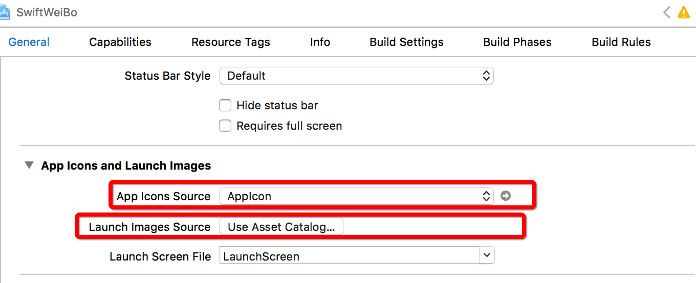
		
		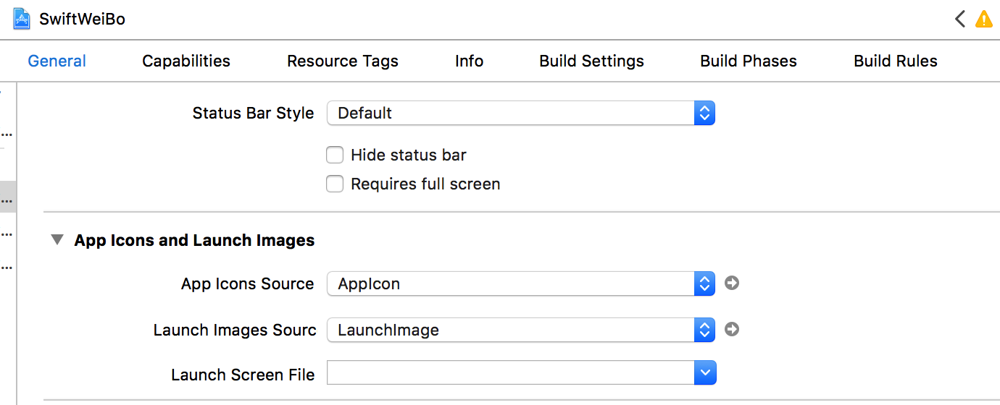
		
		- waring处理
		warning: Ambiguous Content: The launch image set "LaunchImage" has 2 unassigned children.

		删除下面的unassigned
		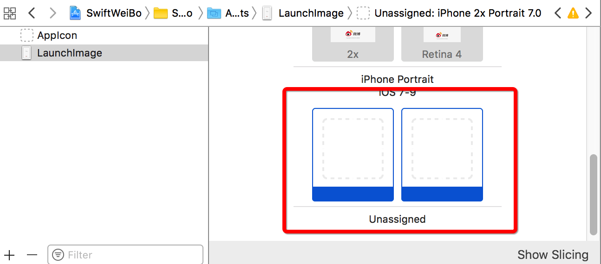
		
		
- 项目文件(模块划分)/ 项目目录结构划分

	根据项目的需求，划分为4大模块5个主要文件夹，用于后期增加代码时源文件的存储位置，项目文件规范存储，便于后期查找
	
	
	
- 项目主界面初始化

	- 纯代码方式
	
		- Appdelegate.swift中
	
		```swift
		func application(application: UIApplication, didFinishLaunchingWithOptions launchOptions: [NSObject: AnyObject]?) -> Bool {
	        
	        // 设置全局颜色
	        UITabBar.appearance().tintColor = UIColor.orangeColor()
	        
	        // 创建window
	        window = UIWindow(frame: UIScreen.mainScreen().bounds)
	        window?.rootViewController = MainViewController()
	        window?.makeKeyAndVisible()
	        
	        return true
	    }
		```
	
		- MainViewController中
	
		```swift
		override func viewDidLoad() {
	        super.viewDidLoad()
	                
	        // 添加子控制器
	        addChildViewController(HomeViewController(), title: "首页", imageName: "tabbar_home")
	        addChildViewController(MessageViewController(), title: "消息", imageName: "tabbar_message_center")
	        addChildViewController(DiscoverViewController(), title: "发现", imageName: "tabbar_discover")
	        addChildViewController(ProfileViewController(), title: "我", imageName: "tabbar_profile")
	    }
	    
	    // swift支持方法的重载
	    // 方法的重载:方法名称相同,但是参数不同. --> 1.参数的类型不同 2.参数的个数不同
	    // private：访问控制，只有当前类能访问(swift3.0之后当前文件的extension 也不能访问)
	    // fileprivate: 当前文件能访问
	    private func addChildViewController(_ childVc: UIViewController, title: String, imageName: String) {
	        
	        // setTitleTextAttributes设置字体等属性
	        childVc.tabBarItem.title = title
	        childVc.tabBarItem.image = UIImage(named: imageName)
	        childVc.tabBarItem.selectedImage = UIImage(named: imageName + "_highlighted")
	        
	        let nav = UINavigationController(rootViewController: childVc)
	        addChildViewController(nav)
	    }
		```
	
		- 注意点：(swift语法)
	
		1. 方法的重载：
	 
	 		`方法名称相同,但是参数不同. --> 1.参数的类型不同 2.参数的个数不同`
		2. 访问控制：
		
			`private` `fileprivate` 等
	
	
	
	-  动态创建控制器对象
		- swfit中直接从利用类名无法创建出对象，这点与OC不同，在于swift的namespace机制
		
			```swift
			class MainViewController: UITabBarController {

    			override func viewDidLoad() {
        			super.viewDidLoad()
        		
        			print(self)	
        		}
			
			// 输出结果
			// 前面的SwiftWeiBo就是当前类所在的namespace名称
			// <SwiftWeiBo.MainViewController: 0x7fa3745072a0>
			```
		- swift使用类名创建控制器
			
			```swift
			/// 通过类名创建控制器(直接使用类名无法生成class，原因在与swift的命名空间namespace)
			private func viewController(forName vcName:String ) -> UIViewController? {
				// 1.获取命名空间名称（swift3.0 NSBundle改为Bundle）
        		guard let infoDict = Bundle.main.infoDictionary else {
            		// 获取不到infodict
            		return nil
        		}
				guard let namespace = infoDict["CFBundleExecutable"] as? String else {
            		// CFBundleExecutable的值取不到
            		return nil
        		}
        		
        		// 2.拼接完整的类名
        		let vcClassName = namespace + "." + vcName
        		
        		// 3.通过类名创建对象
        		guard let vcClass = NSClassFromString(vcClassName) else {
            		return nil
        		}
        		guard let vcClassType = vcClass as? UIViewController.Type else {
        			return nil
        		}
        		let vc = vcClassType.init()
        		
        		return vc
			}
			```
	
		
		- 注意点:
		
		1. swift的namespace机制，导致类名的className格式为`namespace.classname`
			
			如何获取当前namesapce 参考博客：<http://blog.csdn.net/chengkaizone/article/details/50533858>
		
		2.  swift中通过classname创建对象与OC完全不一样
		
			参考：<https://mp.weixin.qq.com/s?__biz=MzIzMzA4NjA5Mw==&mid=213993163&idx=1&sn=95cf79bed2707961ec1a6c17c9103d8a&scene=18#rd>
	
	
	- 通过json文件动态初始化主界面
	
		```swift
		private func addChildViewControllerFromJsonFile() {
			// 1.获取json文件路径
        	guard let filePath = Bundle.main.path(forResource: "MainVCSettings.json", ofType: nil) else {
          		return;
        	}
        	
        	// 2.读取jsondata
        	guard let jsonData = NSData(contentsOfFile: filePath) as? Data else {
            	return
        	}
        	
        	// 3.解析jsondata（需要捕捉异常）
			guard let anyObject = try? JSONSerialization.jsonObject(with: jsonData, options: .mutableContainers) else {
            	return;
        	}
        	
        	// 4.将Any转成[[String:String]]
        	guard let dictArr = anyObject as? [[String:String]] else {
            	return;
        	}
        	
        	// 5.遍历，添加子控制器
        	for dict in dictArr {
        	// 注意，需要使用continue 
		        guard let childVcName = dict["vcName"] else {
		            continue
		        }
	    
		        guard let title = dict["title"] else {
		            continue
		        }
	    
		        guard let imageName = dict["imageName"] else {
		            continue
		        }
	    	
		    	addChildViewController(childVcName: childVcName, title: title, imageName: imageName)
        	}
		}
		
		/// 通过类名添加子控制器
		private func addChildViewController(childVcName: String, title: String, imageName: String) {
			// viewController(forName: childVcName)，上面使用类名创建控制器
    		guard let childVc = viewController(forName: childVcName) else {
        		return;
    		}
    		childVc.tabBarItem.title = title
    		childVc.tabBarItem.image = UIImage(named: imageName)
    		childVc.tabBarItem.selectedImage = UIImage(named: imageName + "_highlighted")
    
    		let nav = UINavigationController(rootViewController: childVc)
    		addChildViewController(nav)
		}
		```
		
		- 注意点
			
			1. json文件数据读取进来是一堆二进制数据（NSData/Data）,需要进行序列化
			2. swift中异常的捕捉:
				如果在调用系统某一个方法时,该方法最后有一个throws.说明该方法会抛出异常.如果一个方法会抛出异常,那么需要对该异常进行处理
				* 第一种: try方式 程序员手动捕捉异常
					
					```swift
					do {
        				let anyObject = try JSONSerialization.jsonObject(with: jsonData, options: .mutableContainers)
    				} catch {
       	 				print(error)
    				}
					```
					
				* 第二种 try?方式 (常用方式) 系统帮助我们处理异常,如果该方法出现了异常,则该方法返回nil.如果没有异常,则返回对应的对象
				
					```swift
					guard let anyObject = try? JSONSerialization.jsonObject(with: jsonData, options: .mutableContainers) else {
            			return;
        	}
					```
				
				* 第三种 try!方式(不建议,非常危险) 直接告诉系统,该方法没有异常.注意:如果该方法出现了异常,那么程序会报错(崩溃)
	
					```swift
					let anyObject = try! NSJSONSerialization.JSONObjectWithData(jsonData, options: .MutableContainers)
					```
					
	- 使用Main.Storyboard初始化主界面
	
		- 使用storyboard reference划分模块
		
		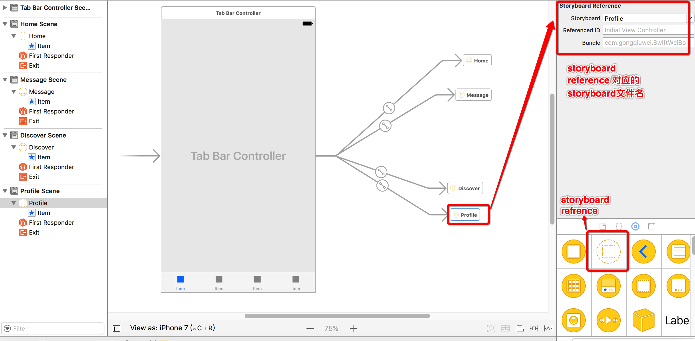
		
		- TabbarItem的设定
		
		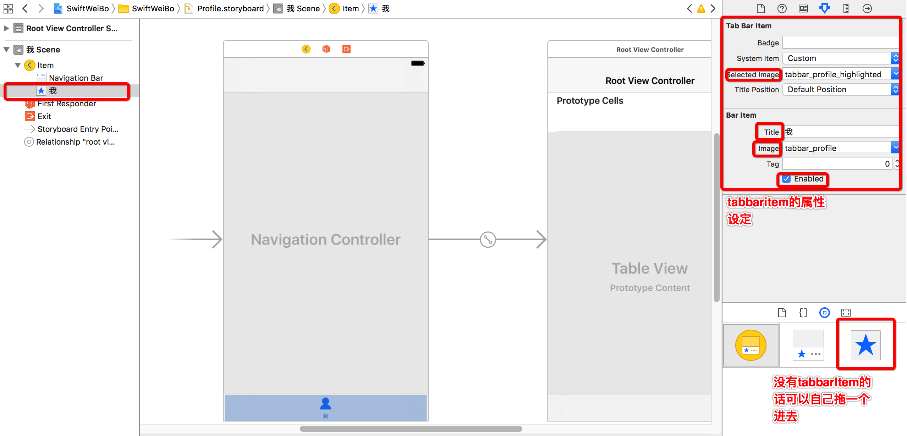
		
		- Tabbar中间加号按钮的设定
		
			1. 使用一个空白的控制器在tabbar中占一个位置，并设置item的enable属性为false
		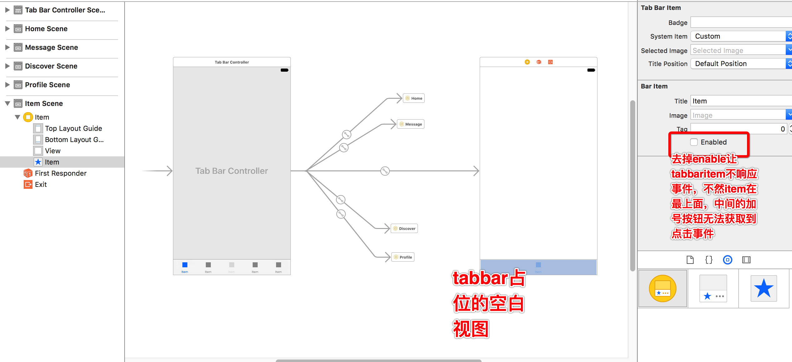
		
			2. 使用代码添加加号按钮
		
			MainViewController.swift中
			
			```swift
			fileprivate func setupComposeBtn() {
	        	tabBar.addSubview(composeBtn)
	        
	        	// 设置属性
	        	composeBtn.setBackgroundImage(UIImage(named: "tabbar_compose_button"), for: .normal)
	        	composeBtn.setBackgroundImage(UIImage(named: "tabbar_compose_button_highlighted"), for: .highlighted)
	        	composeBtn.setImage(UIImage(named: "tabbar_compose_icon_add"), for: .normal)
	       	composeBtn.setImage(UIImage(named: "tabbar_compose_icon_add_highlighted"), for: .highlighted)
	        
	        	// 设置位置尺寸
	        	// 设置好图片后，可以使用这个方法让按钮尺寸进行自适应
	        	composeBtn.sizeToFit()
	        
	        	// swift中结构体的创建，使用init构造函数
	        	// composeBtn.center = CGPointMake(tabBar.center.x, tabBar.bounds.size.height*0.5)
	        	composeBtn.center = CGPoint(x: tabBar.center.x, y: tabBar.bounds.size.height*0.5)
	    	}
			```
		
		
		- 扩充知识

			1. 抽取常用代码到Extension中，（OC是抽取到cagetory中）
				
				UIButton-Extension.swift文件对系统类UIButton进行方法扩充
				
				```swift
				// swift中类方法是以class开头的方法.类似于OC中+开头的方法
				class func createBtn(imageName:String, bgImageName:String) -> UIButton {
					let btn = UIButton()
					
					btn.setBackgroundImage(UIImage(named: bgImageName), for: .normal)
					btn.setBackgroundImage(UIImage(named: bgImageName + "_highlighted"), for: .highlighted)
					btn.setImage(UIImage(named: imageName), for: .normal)
					btn.setImage(UIImage(named: imageName + "_highlighted"), for: .highlighted)
					
					// 设置好图片后，可以使用这个方法让按钮尺寸进行自适应
					btn.sizeToFit()
					
					return btn
				}
				
				
				/*
				便利构造函数
				使用convenience修饰的构造函数叫做便利构造函数
				便利构造函数通常用在对系统的类进行构造函数的扩充时使用
				
				遍历构造函数的特点
				1.遍历构造函数通常都是写在extension里面
				2.遍历构造函数init前面需要加载convenience
				3.在遍历构造函数中需要明确的调用self.init()或其他已提供的构造函数
				*/
				convenience init(imageName:String, bgImageName:String) {
					// 调用self.init,或者提供的其他构造函数，显示调用
					self.init()
					
					// 属性设置
					setBackgroundImage(UIImage(named: bgImageName), for: .normal)
					setBackgroundImage(UIImage(named: bgImageName + "_highlighted"), for: .highlighted)
					setImage(UIImage(named: imageName), for: .normal)
					setImage(UIImage(named: imageName + "_highlighted"), for: .highlighted)
					
					// 设置好图片后，可以使用这个方法让按钮尺寸进行自适应
					sizeToFit()
				}
				```
			
				 - 小结：
				
					swift中，快速创建对象，推荐使用构造函数，而不是像OC中使用类方法
					
					例如：
						UIImage
					 	
					 	*  [UIImage imageName:imageName]; // OC
						*  UIImage(name:imageName); // swift
			2. swift按钮点击事件
			
				- 事件监听原理
					
					* 事件监听本质发送消息.但是发送消息是OC的特性
					* 将方法包装成@SEL --> 类中查找方法列表 --> 根据@SEL找到imp指针(函数指针) --> 执行函数
					* 如果swift中将一个函数声明称private/fileprivate,那么该函数不会被添加到方法列表中
					* 如果在private前面加上`@objc`,那么该方法依然会被添加到方法列表中
				- swift中SEL包装
					* 无参数 `#selector(composeBtnClicked)`
					* 带参数 `#selector(composeBtnClicked(sender:))`
					
					```swift
					func composeBtnClicked() {
						print("---composeBtnClicked---")
					}
					
					func composeBtnClicked(sender: UIButton) {
						print("---composeBtnClicked--\(sender)-")
					}
					```
				- 示例：按钮事件监听
					- 参考1： <http://swift.gg/2016/07/27/swift3-changes/>
					- 参考2：<http://swift.gg/2016/06/02/swift-selector-syntax-sugar/>
					
					swift在编译时期就检查#selector是否存在，相对于OC更安全，提前发现错误
					
					```swift
					// 建议在方法明前面加上类名（编译时期）
					composeBtn.addTarget(self, action: #selector(MainViewController.composeBtnClicked(sender:)), for: .touchUpInside)
					
					// 函数声明称private/fileprivate,那么该函数不会被添加到方法列表中
					// 前面加上@objc,表示是OC类型的消息函数，需要添加到方法列表中
					@objc fileprivate func composeBtnClicked(sender: UIButton) {
						print("---composeBtnClicked--\(sender)-")
					}
					```
					
			3. 一个警告的处理 missing file from working copy
			
				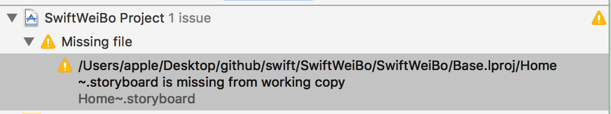
			
				- 警告原因：git 管理了工程文件，但是在删除过程中处理不当，没有通过git进行文件删除导致
				- 处理参考：<http://blog.csdn.net/gdutxzy/article/details/41476965>

- 项目通用需求一： 未登录情况下的访客视图

	- 需求： 
	
		<figure class="half">
	    	
	    	<span></span>
	    	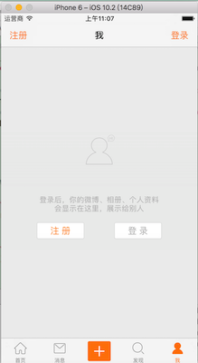
		</figure>
	
	- 思路：
		
		- 4个页面都有访客视图，因此采用继承方式，都继承自baseViewController，由baseViewController判断是否登录然后在`loadView`方法中加载不同的视图
		- 访客视图单独写一个类 `VisitorView` 进行管理
			* 提供类方法，快速从xib中加载视图
			* 设置不同的界面
			* 旋转动画 （CABasicAnimation）
		- 利用xib文件描述 `VisitorView`
	

- Home页面需求

	- navigationBar设定
		- leftItem、rightItem设定
			- 抽取UIBarButtonItem的Extension类，实现代码的可复用
			
			```swift
			extension UIBarButtonItem {
				/// 使用imagename直接生成UIBarButtonItem
				convenience init(imageName: String) {
					let btn = UIButton()
					btn.setImage(UIImage(named:imageName), for: .normal)
					btn.setImage(UIImage(named:imageName + "_highlighted"), for: .highlighted)
					btn.sizeToFit()
					
					// 便利构造函数，需要显示调用其他已经存在的init构造函数
					self.init(customView: btn)
				}
			}
			
			// 使用
			navigationItem.leftBarButtonItem = UIBarButtonItem(imageName: "navigationbar_friendattention")
			```
			
		- titleView设定
			- 普通按钮的图片在左，文字在右，现在需要的按钮是文字在左图片在右，因此需要自定义按钮
			
			```swift
			class TitleButton: UIButton {
				// 不能重写init方法，UI控件一般重写init(frame:)方法
				// UI控件的init方法内部会调用init(frame:)
				override init(frame: CGRect) {
					// 先使用super 生成对象，在对对象的属性进行设定，要在显示调用
					super.init(frame: frame)
					
					setImage(UIImage(named:"navigationbar_arrow_down"), for: .normal)
					setImage(UIImage(named:"navigationbar_arrow_up"), for: .selected)
					setTitleColor(UIColor.black, for: .normal)
					sizeToFit()
					// 去除高亮状态图片变暗
					adjustsImageWhenHighlighted = false
				}
				
				// swift中规定:重写控件的init(frame方法)或者init()方法,必须重写init?(coder aDecoder: NSCoder)
				required init?(coder aDecoder: NSCoder) {
					fatalError("init(coder:) has not been implemented")
				}
				
				// 重新布局内部的子控件
				override func layoutSubviews() {
					// 必须先调用
					super.layoutSubviews()
					
					titleLabel!.frame.origin.x = 0
					imageView!.frame.origin.x = titleLabel!.frame.size.width + 5
				}
			}
			```
			
	- 仿照iPad的popover效果
		
		- 页面布局（图片的保护拉伸）
		
			<figure class="half">
		    	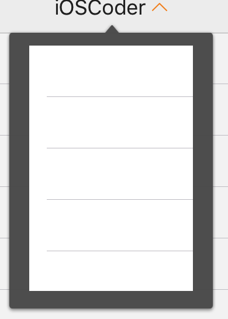
		    	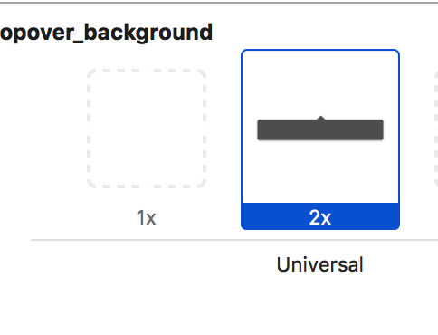
			</figure>
		
			- 代码： 利用UIImage类 `resizableImageWithCapInsets:resizingMode` & `resizableImageWithCapInsets:`
			
			- xcode的assets自带slicing功能
				
				- 图文设置(参考: <http://blog.csdn.net/minjing_lin/article/details/51029296> )
				
					
				
				- 数字属性设置
				
					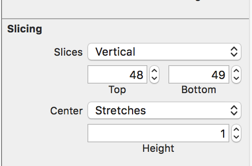
			
		- 自定义modal转场
			
			1. 使用modal自定义转场

				```swfit
				// 需要present出的vc
				let popover = PopoverViewController()
				
				// custom：表示当popvc被present出来之后，原来的homevc控制器是需要保留的
				// 默认是不需要保留，由于当前需求是能看到后面的视图，因此这个需要设定
				popover.modalPresentationStyle = .custom
				
				// present的转场代理，设置后系统根据它进行转场
				popover.transitioningDelegate = popoverAnimator
				
				present(popover, animated: true, completion: nil)
				```
			2. 设置自定义转场代理对象（transitioningDelegate对象）
				
				```swift
				// 返回的对象继承自UIPresentationController
				// UIPresentationController主要用来控制转场的时候的视图层级
				// containerView，presentedView，presentingView等等后面详细介绍
				func presentationController(forPresented presented: UIViewController, presenting: UIViewController?, source: UIViewController) -> UIPresentationController? {
					
					// 返回自定义的UIPresentationController子类对象
					return PopoverPresentationController(presentedViewController: presented, presenting: presenting)
				}
				
				// 返回值是一个遵守UIViewControllerAnimatedTransitioning协议的NSObject对象
				// 该对象根据协议去描述present弹出时候的动画控制，后面介绍使用
				func animationController(forPresented presented: UIViewController, presenting: UIViewController, source: UIViewController) -> UIViewControllerAnimatedTransitioning? {
					return self
				}
				
				// 返回值同上
				// 主要描述dismiss动画
				func animationController(forDismissed dismissed: UIViewController) -> UIViewControllerAnimatedTransitioning? {
					return self
				}
				```
			
			3. UIPresentationController视图层级管理
				 
				 * 普通present时候的视图层级 
					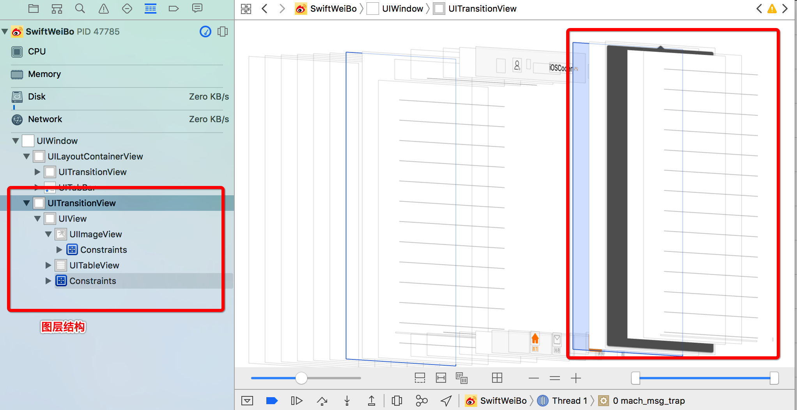
					
				 * 层级结构：
				 	- UITransitionView：系统添加的用来做Present转场的view，要present出来的vc的view会被添加到这里面去
				 	- UIView：被present出来的vc的view
				 	- UIImageView，UITableView：vc内部的子控件
				 * 在UIPresentationController类中，我们可以拿到UITransitionView（containerView属性）和 UIView（presentedView属性），然后可以控制uiview的farme等等属性，具体如下
				 
				 ```swift
				 class PopoverPresentationController: UIPresentationController {
				 	private lazy var coverView : UIView = UIView()
				 
				 	/// containerView开始布局
				 	override func containerViewWillLayoutSubviews() {
				 		super.containerViewWillLayoutSubviews()
				 	
				 		// 设置present出来的view的属性
				 		presentedView?.frame = CGRect(x: 100, y: 55, width: 180, height: 250);
				 		presentedView?.backgroundColor = UIColor.clear
				 	
				 		// 加一层蒙版, 不建议直接去设置containerView，有可能系统会做其他的事
				 		setupCoverView()
				 	}
				 
				 	/// 设置蒙版
				 	private func setupCoverView() {
				 		containerView?.insertSubview(coverView, at: 0)
				 		coverView.backgroundColor = UIColor(white: 0.8, alpha: 0.2)
				 		// ?? 空合运算符 表示的意思：a != nil ? a! : b
				 		coverView.frame = (containerView?.bounds) ?? CGRect.zero
				 	
				 		// 添加手势事件
				 		let tapGes = UITapGestureRecognizer(target: self, action: #selector(PopoverPresentationController.coverViewClicked))
				 		coverView.addGestureRecognizer(tapGes)
					 }
					
					 /// 点击事件监听
					 @objc private func coverViewClicked() {
						presentedViewController.dismiss(animated: true, completion: nil)
					 }
				}
				 ```
			
			4. UIViewControllerAnimatedTransitioning动画控制
				
				```swift
				//MARK:- present&dismiss动画控制
				extension PopoverAnimator : UIViewControllerAnimatedTransitioning {
					// 动画时长，协议中必须实现方法
					func transitionDuration(using transitionContext: UIViewControllerContextTransitioning?) -> TimeInterval {
						return 0.5
					}
					
					// present&dismiss转场动画的代码，在这里写动画代码
					func animateTransition(using transitionContext: UIViewControllerContextTransitioning) {
						// present动画和dismiss动画都会在这里，因此需要判断
						isPresented ? animateTransitionForPresent(using: transitionContext) : animateTransitionForDismiss(using: transitionContext)
					}
					
					// presented动画
					private func animateTransitionForPresent(using transitionContext: UIViewControllerContextTransitioning) {
						// 0. 获取要弹出的view
						let presentedView = transitionContext.view(forKey: UITransitionContextViewKey.to)
						
						// 1. 手动将view添加到contanerView中，自定义动画后，系统不会帮我们做
						transitionContext.containerView.addSubview(presentedView!)
						
						// 2. 利用transform做动画
						presentedView?.transform = CGAffineTransform(scaleX: 1.0, y: 0.00001)
						// 设置view的锚点，transform动画是从锚点开始的，默认锚点在view中间
						presentedView?.layer.anchorPoint = CGPoint(x: 0.5, y: 0.0)
						// 3.动画
						let time = transitionDuration(using: transitionContext)
						UIView .animate(withDuration: time, animations: { (_) in
							presentedView?.transform = CGAffineTransform.identity
						}, completion: { (_) in
							// 动画完成后必须调用这个方法，不然系统认为动画还在进行，不会结束
							transitionContext.completeTransition(true)
						}
					}
					
					// dismiss动画
					private func animateTransitionForDismiss(using transitionContext: UIViewControllerContextTransitioning) {
						// 1.获取消失的view
						let dismissView = transitionContext.view(forKey: .from)
						
						// 2.执行动画
						UIView.animate(withDuration: time, animations: {
							// 注意，这里y不能为0，view会直接消息掉，系统原因
							dismissView?.transform = CGAffineTransform(scaleX: 1.0, y: 0.0001)
						}) { (_) in
							// 告诉系统结束动画
							transitionContext.completeTransition(true)
							// 手动移除view
							dismissView?.removeFromSuperview()
						}
					}
				}
				```
				
	- cocoapods进行第三方框架管理
		
		- 初始化pod  打开到.xcodeproj目录下，pod init初始化podfile文件
		- pod search AFNetworking (搜寻最新的版本)
		- podfile文件书写
			
			```podfile
			platform :ios, '9.0'
			
			target 'SwiftWeiBo' do
				use_frameworks!
				
				pod 'AFNetworking', '~> 3.1.0'
				pod 'SVProgressHUD', '~> 2.2.2'
				pod 'SDWebImage', '~> 4.2.2'
				pod 'SnapKit', '~> 3.2.0'
				
			end
			``` 
			
	- 基于AFNetworking简单封装请求工具类NetworkTool

		- 方便的测试http的网站：http://httpbin.org 发送哪个请求，将请求的数据封装返回，例如post请求测试地址 `http://httpbin.org/post`
		- NetworkTool工具类的封装（关注点）
			- 单例模式的实现
			- 使用枚举定义请求的类型
			- 返回数据的回调

		```swift
		// 如果需要默认值，就必须定义类型，如果不需要默认值，那么无需定义类型
		enum RequestType : String {
    		case get = "GET"
    		case post = "POST"
		}
		
		class NetworkTool: AFHTTPSessionManager {
		
			/**
     		iOS实现单例模式的方法：
     		1> 通过shareXXX或者defaultXXX拿到的永远是同一个对象
     		2> 不管通过何种方法，得到的永远是同一个对象
     
     		OC中以上2中都采用过，swift中使用第一种方法非常便利
     		*/
     		// 使用static类型属性常量来实现单例模式。。。。
    		static let shareInstance : NetworkTool = {
        		let tool = NetworkTool()
        		tool.responseSerializer.acceptableContentTypes?.insert("text/html")
        		return tool
    		}()
    		
    		func request(withType requestType: RequestType,urlString: String, parameters: Any?, finishedCallBack:((_ result: Any?, _ error: Error?)->())?){
    		
    			// 我们可以先定义好闭包然后在到方法里调用，不用每次都在方法里面写很多闭包代码。。。
    			// 成功回调
        		let sucessCallBack = { (task:URLSessionDataTask, result:Any?) in
            		if let finishedCallBack = finishedCallBack {
                		finishedCallBack(result, nil)
            		}
        		}
    		
    			// 失败回调
        		let failureCallBack = { (task:URLSessionDataTask?, error:Error) in
            		if let finishedCallBack = finishedCallBack {
                		finishedCallBack(nil, error)
            		}
        		}
        		
        		// 发送请求
        		switch requestType {
        		case .get:
            		get(urlString, parameters: parameters, progress: nil, success: sucessCallBack, failure: failureCallBack)
        		case .post:
            		post(urlString, parameters: parameters, progress: nil, success: sucessCallBack, failure: failureCallBack)
        		}
    		}
		}
		
		// 外部调用测试：
		NetworkTool.shareInstance.request(withType: .post, urlString: "http://httpbin.org/post", parameters: ["name" : "xxx", "age" : 18]) { (result:Any?, error:Error?) in
            if let error = error {
                print(error)
                return
            }
            
            print(result ?? "没有返回数据")
        }
		```
		
		
	- sina微博auth授权
		- 注册成为开发者，并注册app，获取app相关信息
			
			- 回调网址 http://www.baidu.com
			- App Key：4061287819
			- App Secret：6be87e2c73f46562c27621c2d9d70256
		- 加载微博OAuthor授权网页

			OAuthorViewController.switf中
			
			- 加载web页面
				
			```swift
			/// 加载web授权页面
			fileprivate func loadWebPage() {
    			let urlString = "https://api.weibo.com/oauth2/authorize?client_id=\(app_key)&redirect_uri=\(redirect_uri)"
    			guard let url = URL(string: urlString) else {
        			return
    			}
    			let request = URLRequest(url: url)
    			webView.loadRequest(request)
			}
			```
				
			- 获取code(利用webview代理方法，拦截web请求)
			
			```swift
			func webView(_ webView: UIWebView, shouldStartLoadWith request: URLRequest, navigationType: UIWebViewNavigationType) -> Bool {
				// 获取url
        		guard let urlString = request.url?.absoluteString else {
            		print("没有url")
            		return true
        		}
        		
        		// 判断是否有code
        		guard urlString.contains("code=") else {
           			// 不包含code=， 不做处理
            		return true
        		}
        		
        		// 包含code=, 截取code=后面的字符串
        		guard let code = urlString.components(separatedBy: "code=").last else {
            		// 截取不到字符串
            		return true
        		}
        		
        		// 利用code去获取access_token
        		loadAccessToken(byCode: code)
			}
			```
			
			- 利用code获取access_token

			```swift
			fileprivate func loadAccessToken(byCode code: String) {
				// 请求网络
        		NetworkTool.shareInstance.loadAccessToken(byCode: code) { (result:[String : Any]?, error:Error?) in
				
				// 可选绑定， 有值执行{}内语句
            	if let error = error {
                	print(error)
                	return
            	}
            	
            	// 判断result是否有值
            	guard let resultDict = result  else {
                	print("没有授权后的数据")
                	return
            	}
            	
            	// 有值的时候，取出里面的信息, 转化成UserAccount模型
            	let account = UserAccount(dict: resultDict)
            	print(String(reflecting: account))
			}
			```
			- 保存access_token（UserAcount模型）
				- 自定义构造函数，利用字典进行构造 `init(dict:[String:Any])`
				- 当字典有其他键值对的时候，需要重写`override func setValue(_ value: Any?, forUndefinedKey key: String)`
				- 对象的自定义log输出，
					- 遵守CustomDebugStringConvertible协议
					- 重写`override var debugDescription: String`
					- 模型转字典：`dictionaryWithValues(forKeys: ["access_token", "expires_in", "uid"]).debugDescription`
					- 使用自定义对象的log：`print(String(reflecting: account))`
			- 利用access_token获取用户信息
				- 接口请求：http://open.weibo.com/wiki/2/users/show
			
			- 自定义UserAccount对象的存储
				- 自定义对象写入文件需要遵守NSCoding协议，进行归档&解档
				
				```swift
				//MARK:- NSCoding
			    /// 归档
			    required init?(coder aDecoder: NSCoder) {
			        access_token = aDecoder.decodeObject(forKey: "access_token") as? String
			        uid = aDecoder.decodeObject(forKey: "uid") as? String
			        expire_date = aDecoder.decodeObject(forKey: "expire_date") as? Date
			        screen_name = aDecoder.decodeObject(forKey: "screen_name") as? String
			        avatar_large = aDecoder.decodeObject(forKey: "avatar_large") as? String
			    }
			    
			    /// 解档
			    func encode(with aCoder: NSCoder) {
			        aCoder.encode(access_token, forKey: "access_token")
			        aCoder.encode(uid, forKey: "uid")
			        aCoder.encode(expire_date, forKey: "expire_date")
			        aCoder.encode(screen_name, forKey: "screen_name")
			        aCoder.encode(avatar_large, forKey: "avatar_large")
			    }
			    
			    // 对象归档
			    // account对象归档存储
            	NSKeyedArchiver.archiveRootObject(account, toFile: accountPath)
            	// 解档
            	let account = NSKeyedUnarchiver.unarchiveObject(withFile: accountPath) as? UserAccount
				```
				
				- 创建accountTool工具类处理account相关
					- account处理代码散落各处，到时候维护可能会比较困难，例如：修改存储路径，存储和获取account地方代码都需要修改，而不再一个文件内部，会产生问题； 再例如：获取account判断是否登录，每个使用到的地方都需要写一堆代码。因此，对这些进行一层业务工具类的封装处理
					
					```swift
					OAuthorViewController中保存account
					{
					// 保存account到沙盒
            		// 沙盒document目录下
            		var accountPath = NSSearchPathForDirectoriesInDomains(.documentDirectory, .userDomainMask, true).last!
            
            		accountPath = accountPath + "/account.plist"
            		print(accountPath)
            
            		// account对象归档存储
            		NSKeyedArchiver.archiveRootObject(account, toFile: accountPath)
            		}
            		
            		
            		BaseViewController中获取account
            		{
	            		// 判断用户是否登录
	        			var accountPath = NSSearchPathForDirectoriesInDomains(.documentDirectory, .userDomainMask, true).last!
	        			accountPath = accountPath + "/account.plist"
        
        				if let account = NSKeyedUnarchiver.unarchiveObject(withFile: accountPath) as? UserAccount {
		            			// 有account对象
		            			if let expireDate = account.expire_date {
		                		// 有过期时间，判断是否过期
		                		let result = expireDate.compare(Date())
		                		// 降序，也就是expireDate大
		                		isLogin = (result == .orderedDescending)
	            			}
            			}
        			}
					
					```
					
					
					- acountTool封装

					```swift
					// 业务工具类，不需要用到NSObject的一些东西，因此可以不继承自NSObject，更轻量级
					class UserAccountTool {
					
						// 设计成单例
						static let shareInstance : UserAccountTool = UserAccountTool()
						
						// 是否登录，计算属性
						var isLogin : Bool {
							if account == nil {
								return false
							}
							
							guard let expiresDate = account?.expire_date else{
								return false
							}
							
							// expiresDate比当前时间大，降序
							return expiresDate.compare(Date()) == ComparisonResult.orderedDescending
						}
						
						// 存储路径，计算属性
						var accountPath : String {
							let accountPath = NSSearchPathForDirectoriesInDomains(.documentDirectory, .userDomainMask, true).last!
							print(accountPath)
							return accountPath + "/account.plist"
						}
						
						// 保存一个account对象
						var account : UserAccount?
						
						init() {
							account = NSKeyedUnarchiver.unarchiveObject(withFile: accountPath) as? UserAccount
						}
						
						func saveAccount(account : UserAccount) {
							self.account = account
							NSKeyedArchiver.archiveRootObject(account, toFile: accountPath)
						}
					}
					```
					
					
	- 欢迎界面
		- 布局
		- NSLayoutConstraint动画: 先修改，在调用layoutIfNeeded刷新布局
			
			```swift
			override func viewDidAppear(_ animated: Bool) {
        		// 头像动画
        		iconViewBottomContraints.constant = UIScreen.main.bounds.height - 200
        
        		// 弹簧动画
        		// damping:阻力系数， 0~1 ，越大弹簧效果越小
        		// SpringVelocity: 初始速度
        		UIView.animate(withDuration: 1.5, delay: 0.0, usingSpringWithDamping: 0.7, initialSpringVelocity: 5, options: .curveEaseInOut, animations: {
		            self.view.layoutIfNeeded()
		        }) { (_) in
	     		   // 创建Main
	        		// 不能直接创建Main，而要从storyBoard中加载
	        		UIApplication.shared.keyWindow?.rootViewController = MainViewController.loadFromStoryBoard()
        		}
    		}
			```
			
			
	- home主页面
	
		 - 请求数据
		 - 解析数据，模型转换(Status模型， User模型)
		 - 数据处理(对模型的原有属性进行处理，保证使用的时候方便快捷)
		 - HomeViewCell的布局
		 	
		 	- 顶部区域布局
		 	- 底部工具栏布局
		 	- 利用AutoLayout自动计算cell高度
		 		- 子控件布局中，最上面的子控件和cell有约束关系
		 		- 子控件布局中，最下面的子控件和cell有约束关系
		 		- 代码说明需要tableview自动计算cell高度
		 			
		 			```swift
		 			tableView.rowHeight = UITableViewAutomaticDimension
		 			tableView.estimatedRowHeight = 200
		 			```
		 	
		 	- 配图的展示
		 		
		 		- cell中加入配图view
		 		- StatusViewModel处理pic返回数据
		 		- 根据pic的个数计算picView的高度并设定`func caculatePicViewSize(count: Int) -> CGSize{}`
		 			- 处理警告：
		 			
		 			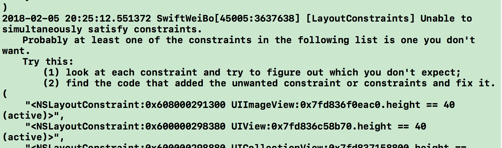
		 			
		 			- 原因分析：picView向上距离contentLabel有10pt间距，向下距离bottom工具栏有10pt间距，当picView的height为0时，这2个约束会产生冲突
		 			
		 			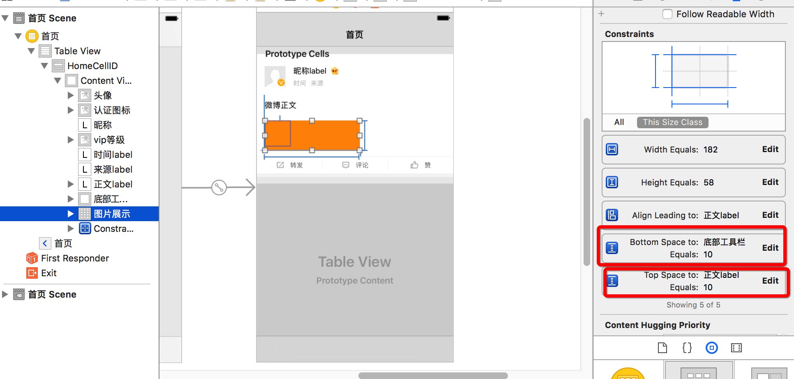
		 			
		 			- 解决方式：降低一个约束的优先级，这里选择降低距离bottm的距离的优先级
		 			
		 			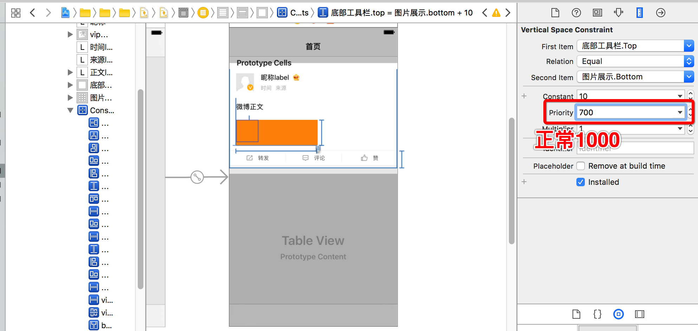
		 			
		 		- 单张图片的特殊处理
		 			- 由于没有返回width、height所以需要先下载好图片，然后计算picView的宽度和高度，在进行处理
		 			- 缓存图片
		 			
		 			```swift
		 			private func cacheImages(viewModels:[StatusViewModel]) {
        
	        			// DispatchGroup组
	        			let group = DispatchGroup()
	        
	        			for viewModel in viewModels {
	            			for picUrl in viewModel.picUrls {
	                			// 开始下载前进入group
	                			group.enter()
	                			// 开始下载图片
	                			SDWebImageDownloader.shared().downloadImage(with: picUrl, options: [], progress: nil, completed: { (_, _, _, _) in
	                    			print("保存一张图片")
	                    			// 下载完成后离开group
	                    			group.leave()
	                			})
	            			}
	        			}
        
        				// 等待图片全部下载完成，reloaddata
        				group.notify(queue: DispatchQueue.main) { 
            				print("下载完成")
            				self.tableView.reloadData()
        				}
    				}
		 			```
		 			
		 			- 根据缓存的图片计算单行图片时候的picView的高度：`func caculatePicViewSize(count: Int) -> CGSize{}`中添加
		 			- bug修复：picView为collectionview类型，由于计算的高度不足，导致collectionview可以拖动，引起tableview的cell无法拖动
		 			
		 			```
		 			// 会出现像素不足的情况，一般向上取整或者+1像素
		 			let picH = rows * imageWH + (rows-1) * itemMargin + 1
		 			```
		
		- 转发微博的处理
			- 获取转发微博数据
			- cell中展示转发微博
				
				- 思路：在之前的基础上，只需要加一个转发微博的内容label即可，由于转发的时候，原创微博的图片是不需要展示的，转发微博的图片可以在原有基础上进行展示，因此只需要添加一个label就可以了
				- 实现：添加一个retweetedContentLabel, 在contentLabel和picView之间，并且设置好约束， 先添加好其他约束，以显示retweetedContentLabel（top, leading, width=contentLabel.width）,确定位置，最后添加距离picView的约束，产生警告, fix it，修改hugging 的等级，也就是label的高度过大，内容会被拉伸，以适应高度，如果想要保持内容不被拉伸过大，就需要提高等级，以保持内容的紧凑
				 
				 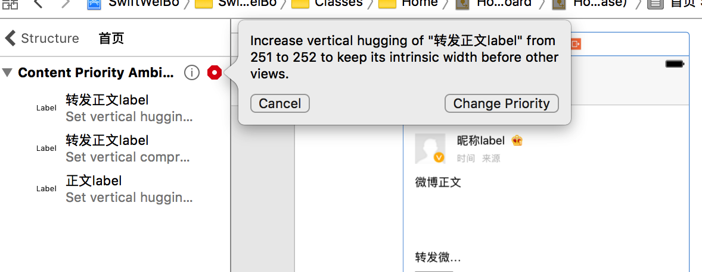
				 
				- 添加了距离picView的约束后，还是利用AutoLayout自动计算cell高度
				- 填充数据展示转发微博正文 `viewModel{didSet{}}`
				- 展示转发微博的配图
					
					- StatusViewModel中的picUrls属性是需要展示的图片，因此只要针对数据进行处理，让picUrls没有转发微博时保存原创的图片，有转发时保存转发的图片，就可以不改动UI代码，直接展示图片(ViewModel管理Cell需要展示的数据，使用ViewModel实现了model和UI的分离)
					- StatusViewModel中对picUrls的处理
						
					```swift
					// 6.处理picUrls, 当有转发时保存转发，没有转发时保存原创
					// 是否有转发？如何判断
					// count 为 Int? , 可以与 Int 进行 == , != 比较
					let count = status.pic_urls?.count
					let picUrlsDict = count != 0 ?  status.pic_urls : status.retweeted_status?.pic_urls
					
					if let pic_urls = picUrlsDict {
						for picDict in pic_urls {
							guard let urlStr = picDict["thumbnail_pic"] else {
								continue
							}
							
							let url = URL(string: tempstr)!
							picUrls.append(url)
						}
					}
					```
				
				- 转发的背景
					- 背景层级，在转发label，图片picView下
					- 约束：距离正文label为8， 底部工具栏0
					- 数据设置：有转发显示，没转发隐藏
				
				- cell整体完成后，约束的细节调整
					
					- bug1：没有转发微博的时候，调整retweetedContentLabel的top约束为0，有为15
					
						
					- bug2：没有配图的时候，调整有配图的时候picview的bottom为15，没有的时候为0
					
					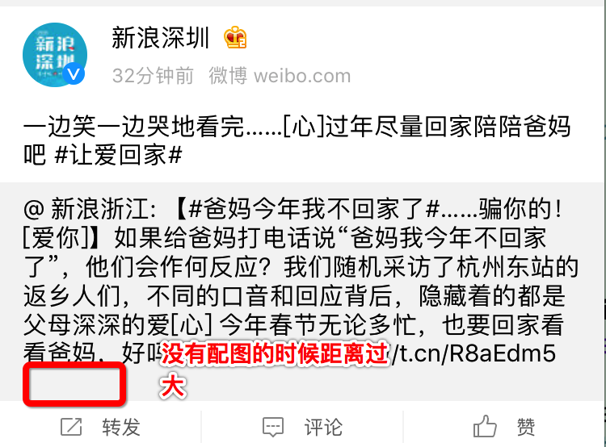
				
		
		- cell的高度自己计算，不适用AutoLayout计算
			- 去掉bottomToolView的底部约束
			- cell中设置viewModel时强制layout布局，计算最底部的控件的maxY，并保存在viewModel的cellHeight属性中
			- tableview代理方法返回cell高度

			
		- 刷新控件
			- pod install --no-repo-update 加载MJRefresh
			- 集成header
				- 加载最新数据
				- 数据拼接 `self.viewModels = tempViewModels + self.viewModels`
			- 集成footer
		
		- 刷新数据的提示label
			- 懒加载label
			
			```swift
			fileprivate lazy var tipLabel: UILabel = {
				let tipLabel = UILabel()
				tipLabel.backgroundColor = UIColor.orange
				tipLabel.textColor = UIColor.white
				tipLabel.font = UIFont.systemFont(ofSize: 13)
				tipLabel.textAlignment = .center
				tipLabel.frame = CGRect(x: 0, y: 10, width: UIScreen.main.bounds.width, height: 32)
				tipLabel.isHidden = true
				// insert到navigationBar中，会被系统强制显示到navigationbarBackground上，没有高斯模糊的效果，因此使用这种方式替代
				self.navigationController?.view.insertSubview(tipLabel, belowSubview: self.navigationController!.navigationBar)
				
				return tipLabel
			}()
			```
			
			- label显示与消失动画

			```swift
			// 显示tiplabel
			let count = viewModels.count
			let string = count == 0 ? "没有最新的微博" : "更新了\(count)条微博"
			self.tipLabel.text = string
			self.tipLabel.isHidden = false
			UIView.animate(withDuration: 1.0, animations: {
				self.tipLabel.frame.origin.y = self.navigationController!.navigationBar.frame.maxY
			}, completion: { (_) in
				UIView.animate(withDuration: 1.0, delay: 1.0, options: [], animations:{
					self.tipLabel.frame.origin.y = 10
				}, completion: { (_) in
					self.tipLabel.isHidden = true
				}）
			}）
			```
			
	- 微博发布界面
		- 导航栏的设定
			- SnapKit的基本使用
			
			```swift
			titleLabel.snp.makeConstraints { (make) in
				make.centerX.equalTo(self)
				make.top.equalTo(self)
			}
			
			screenNameLabel.snp.makeConstraints { (make) in
				make.centerX.equalTo(self)
				make.top.equalTo(self.titleLabel.snp.bottom).offset(2)
			}
			```
			
		- textView自定义
			- 点击textView出现警告，处理方法： 从xcode菜单中：Product > Scheme > Edit Scheme
Environment Variables 添加一栏name：OS_ACTIVITY_MODE  Value:disable
			
			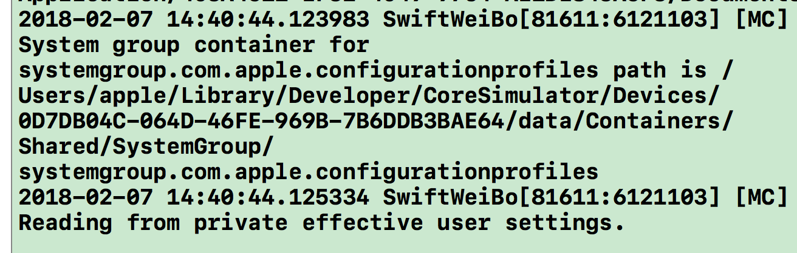
				
			- 细节调整
				- textView输入文字是隐藏placeholderLabel
				- 进入控制器默认弹出键盘
				- textView无内容也可以滑动
				- textView滑动的时候，退出键盘
				
		- 底部toolbar
			
			- 布局：
				- 向toolBar里面推入uibutton，xib会自动包裹成uibarbuttonitem类型
				- item的间距：Flexible Space是弹簧样的自动可变的， Fixed space是固定距离的； 所以左右两边使用fixed item，中间使用 flexible item
			
			- 键盘的监听, 确定toolbar的位置
				
			```swift
			// 添加通知
			NotificationCenter.default.addObserver(self, selector: #selector(ComposeViewController.keyboardWillChangeFrame(note:)), name: NSNotification.Name.UIKeyboardWillChangeFrame, object: nil)
			
			// 移除通知
			deinit {
				NotificationCenter.default.removeObserver(self)
			}
			
			/// 监听键盘frame改变的通知
			@objc fileprivate func keyboardWillChangeFrame(note: Notification) {
				// 获取键盘动画时间
				let duration = note.userInfo![UIKeyboardAnimationDurationUserInfoKey] as! TimeInterval
				
				// 键盘的结束位置, 是NSRect类型， 不能直接强制转换成 CGRect， 会失败
				let endFrame = (note.userInfo![UIKeyboardFrameEndUserInfoKey] as! NSValue).cgRectValue
				let endY = endFrame.origin.y
				
				// 动画
				toolBarBottomConstraint.constant = UIScreen.main.bounds.height - endY
				UIView.animate(withDuration: duration) {
					self.view.layoutIfNeeded()
				}
			}
			```
			
	
		- 图片的选取View
			- 事件监听
			- 布局选择图片的collectionview
			- 自定义PicPickerView继承自Collectionview
				- layout的设定
				- cell的自定义
					- 添加照片
					- 删除照片
				
		
		- 表情键盘
			- 键盘：textView.inputView = nil就是普通键盘， textView.input = UIView()就是自定义键盘
			- 键盘切换：
			
			```swift
			textView.resignFirstResponder() // 先退出键盘
			textView.inputView = UIView() // 设置键盘
			textView.becomeFirstResponder() // 弹出键盘
			```
			
			- 键盘的布局
				- 使用vc进行管理
				- 键盘有如果不设置值，inputView键盘有默认的高度
				- VFL布局子控件，以后可以抽取一个模块 `addSubViews()`
				- collectionView设定 `prepareForCollectionView()` 以及 自定义layout`EmoticonCollectionLayout`
				- toolbar设定 `prepareForToolBar()`

			
			- 表情数据的管理
				
				- 模型建立
				
				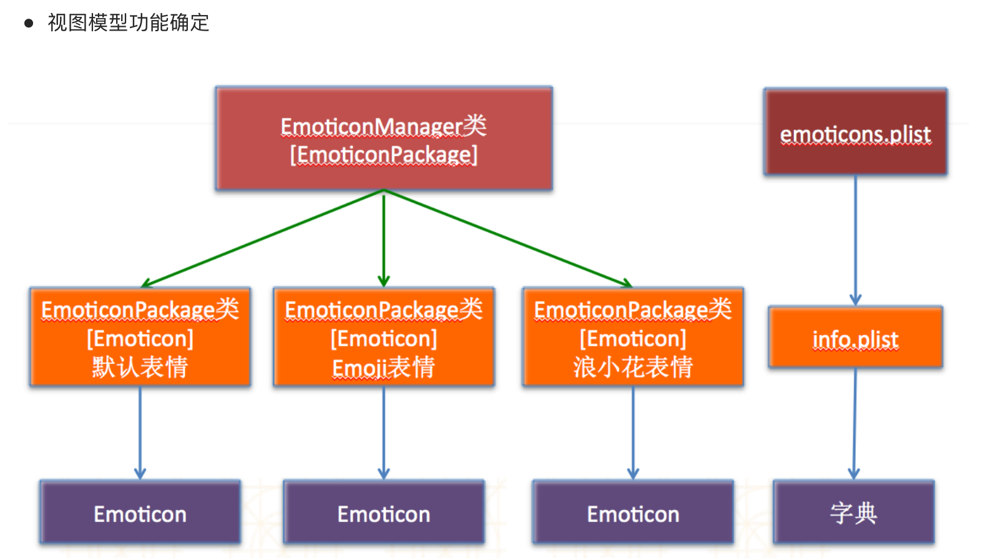
				
				- EmoticonManager类(工具类)，管理所有的表情包
				- EmoticonPackage类，表情包，相当于一个文件
					- 内嵌bundle文件的加载
					- 加载info.plist得到的是OC中的NSArray，而swift中的Array无法这样得到，但是NSArray可以无缝转换到Array
				
				- Emoticon类，单个表情模型
					- swift中模型的debug自定义
					
					```swift
					// 模型的自定义打印
    				// 打印方法 print(String(reflecting:emoticon))
    				override var debugDescription: String {
        				return dictionaryWithValues(forKeys: ["code", "png", "chs"]).debugDescription
    				}
					```
					
					- 属性的处理1：png路径， 转换成全路径
					- 属性处理2: code转换成可以展示的emoji字符
				
				- 删除键：
				- 空白表情：使得每一页都是21个表情按键
				- 记录最近点击的表情，最多20个
				- 删除以及emoji表情插入到textView中