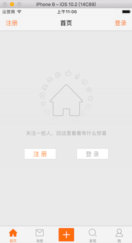
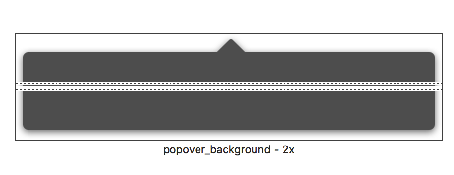

# swift
swift学习记录
xcode版本：xcode8.2.1 swift版本：swift3.0

# swift项目实战

### 一、基本框架的搭建
- 项目的部署(远程仓库)
	- 部署方式
	
		github/OSChina/SVN(一般公司内部使用)
	
	- 注意点： 

		.gitignore需要将pods文件屏蔽，一般不上传pods库到远程仓库，只上传podfile文件，本地 pod update/ pod install
		
		各种语言 .gitignore文件 [gitHub地址](https://github.com/github/gitignore)
		
- 项目初始化
	
	- 1、将远程仓库clone到本地（svn checkout）
	- 2、在本地仓库中创建新的项目（.git隐藏文件所在的同级目录下或者.svn隐藏文件所在的同级目录下）
	- 3、将创建好的项目推送到远程仓库中
	
- 项目基本设定
	- General设定: 
		- display name: app显示的名称
		- deployment target: 最低支持设备的版本
		- devices: 支持设备类型（iPhone/iPad/Universal）
		- device orentation: 横竖屏

		注意：项目设定为iPhone 9.0， 主要是为了使用Storyboard的reference功能（storyboard切割或者模块划分）
		
	- 项目appicon、启动图片

		- 设置appicon与启动图片
		
		
		
		
		
		- waring处理
		warning: Ambiguous Content: The launch image set "LaunchImage" has 2 unassigned children.

		删除下面的unassigned
		
		
		
- 项目文件(模块划分)/ 项目目录结构划分

	根据项目的需求，划分为4大模块5个主要文件夹，用于后期增加代码时源文件的存储位置，项目文件规范存储，便于后期查找
	
	
	
- 项目主界面初始化

	- 纯代码方式
	
		- Appdelegate.swift中
	
		```swift
		func application(application: UIApplication, didFinishLaunchingWithOptions launchOptions: [NSObject: AnyObject]?) -> Bool {
	        
	        // 设置全局颜色
	        UITabBar.appearance().tintColor = UIColor.orangeColor()
	        
	        // 创建window
	        window = UIWindow(frame: UIScreen.mainScreen().bounds)
	        window?.rootViewController = MainViewController()
	        window?.makeKeyAndVisible()
	        
	        return true
	    }
		```
	
		- MainViewController中
	
		```swift
		override func viewDidLoad() {
	        super.viewDidLoad()
	                
	        // 添加子控制器
	        addChildViewController(HomeViewController(), title: "首页", imageName: "tabbar_home")
	        addChildViewController(MessageViewController(), title: "消息", imageName: "tabbar_message_center")
	        addChildViewController(DiscoverViewController(), title: "发现", imageName: "tabbar_discover")
	        addChildViewController(ProfileViewController(), title: "我", imageName: "tabbar_profile")
	    }
	    
	    // swift支持方法的重载
	    // 方法的重载:方法名称相同,但是参数不同. --> 1.参数的类型不同 2.参数的个数不同
	    // private：访问控制，只有当前类能访问(swift3.0之后当前文件的extension 也不能访问)
	    // fileprivate: 当前文件能访问
	    private func addChildViewController(_ childVc: UIViewController, title: String, imageName: String) {
	        
	        // setTitleTextAttributes设置字体等属性
	        childVc.tabBarItem.title = title
	        childVc.tabBarItem.image = UIImage(named: imageName)
	        childVc.tabBarItem.selectedImage = UIImage(named: imageName + "_highlighted")
	        
	        let nav = UINavigationController(rootViewController: childVc)
	        addChildViewController(nav)
	    }
		```
	
		- 注意点：(swift语法)
	
		1. 方法的重载：
	 
	 		`方法名称相同,但是参数不同. --> 1.参数的类型不同 2.参数的个数不同`
		2. 访问控制：
		
			`private` `fileprivate` 等
	
	
	
	-  动态创建控制器对象
		- swfit中直接从利用类名无法创建出对象，这点与OC不同，在于swift的namespace机制
		
			```swift
			class MainViewController: UITabBarController {

    			override func viewDidLoad() {
        			super.viewDidLoad()
        		
        			print(self)	
        		}
			
			// 输出结果
			// 前面的SwiftWeiBo就是当前类所在的namespace名称
			// <SwiftWeiBo.MainViewController: 0x7fa3745072a0>
			```
		- swift使用类名创建控制器
			
			```swift
			/// 通过类名创建控制器(直接使用类名无法生成class，原因在与swift的命名空间namespace)
			private func viewController(forName vcName:String ) -> UIViewController? {
				// 1.获取命名空间名称（swift3.0 NSBundle改为Bundle）
        		guard let infoDict = Bundle.main.infoDictionary else {
            		// 获取不到infodict
            		return nil
        		}
				guard let namespace = infoDict["CFBundleExecutable"] as? String else {
            		// CFBundleExecutable的值取不到
            		return nil
        		}
        		
        		// 2.拼接完整的类名
        		let vcClassName = namespace + "." + vcName
        		
        		// 3.通过类名创建对象
        		guard let vcClass = NSClassFromString(vcClassName) else {
            		return nil
        		}
        		guard let vcClassType = vcClass as? UIViewController.Type else {
        			return nil
        		}
        		let vc = vcClassType.init()
        		
        		return vc
			}
			```
	
		
		- 注意点:
		
		1. swift的namespace机制，导致类名的className格式为`namespace.classname`
			
			如何获取当前namesapce 参考博客：<http://blog.csdn.net/chengkaizone/article/details/50533858>
		
		2.  swift中通过classname创建对象与OC完全不一样
		
			参考：<https://mp.weixin.qq.com/s?__biz=MzIzMzA4NjA5Mw==&mid=213993163&idx=1&sn=95cf79bed2707961ec1a6c17c9103d8a&scene=18#rd>
	
	
	- 通过json文件动态初始化主界面
	
		```swift
		private func addChildViewControllerFromJsonFile() {
			// 1.获取json文件路径
        	guard let filePath = Bundle.main.path(forResource: "MainVCSettings.json", ofType: nil) else {
          		return;
        	}
        	
        	// 2.读取jsondata
        	guard let jsonData = NSData(contentsOfFile: filePath) as? Data else {
            	return
        	}
        	
        	// 3.解析jsondata（需要捕捉异常）
			guard let anyObject = try? JSONSerialization.jsonObject(with: jsonData, options: .mutableContainers) else {
            	return;
        	}
        	
        	// 4.将Any转成[[String:String]]
        	guard let dictArr = anyObject as? [[String:String]] else {
            	return;
        	}
        	
        	// 5.遍历，添加子控制器
        	for dict in dictArr {
        	// 注意，需要使用continue 
		        guard let childVcName = dict["vcName"] else {
		            continue
		        }
	    
		        guard let title = dict["title"] else {
		            continue
		        }
	    
		        guard let imageName = dict["imageName"] else {
		            continue
		        }
	    	
		    	addChildViewController(childVcName: childVcName, title: title, imageName: imageName)
        	}
		}
		
		/// 通过类名添加子控制器
		private func addChildViewController(childVcName: String, title: String, imageName: String) {
			// viewController(forName: childVcName)，上面使用类名创建控制器
    		guard let childVc = viewController(forName: childVcName) else {
        		return;
    		}
    		childVc.tabBarItem.title = title
    		childVc.tabBarItem.image = UIImage(named: imageName)
    		childVc.tabBarItem.selectedImage = UIImage(named: imageName + "_highlighted")
    
    		let nav = UINavigationController(rootViewController: childVc)
    		addChildViewController(nav)
		}
		```
		
		- 注意点
			
			1. json文件数据读取进来是一堆二进制数据（NSData/Data）,需要进行序列化
			2. swift中异常的捕捉:
				如果在调用系统某一个方法时,该方法最后有一个throws.说明该方法会抛出异常.如果一个方法会抛出异常,那么需要对该异常进行处理
				* 第一种: try方式 程序员手动捕捉异常
					
					```swift
					do {
        				let anyObject = try JSONSerialization.jsonObject(with: jsonData, options: .mutableContainers)
    				} catch {
       	 				print(error)
    				}
					```
					
				* 第二种 try?方式 (常用方式) 系统帮助我们处理异常,如果该方法出现了异常,则该方法返回nil.如果没有异常,则返回对应的对象
				
					```swift
					guard let anyObject = try? JSONSerialization.jsonObject(with: jsonData, options: .mutableContainers) else {
            			return;
        	}
					```
				
				* 第三种 try!方式(不建议,非常危险) 直接告诉系统,该方法没有异常.注意:如果该方法出现了异常,那么程序会报错(崩溃)
	
					```swift
					let anyObject = try! NSJSONSerialization.JSONObjectWithData(jsonData, options: .MutableContainers)
					```
					
	- 使用Main.Storyboard初始化主界面
	
		- 使用storyboard reference划分模块
		
		
		
		- TabbarItem的设定
		
		
		
		- Tabbar中间加号按钮的设定
		
			1. 使用一个空白的控制器在tabbar中占一个位置，并设置item的enable属性为false
		
		
			2. 使用代码添加加号按钮
		
			MainViewController.swift中
			
			```swift
			fileprivate func setupComposeBtn() {
	        	tabBar.addSubview(composeBtn)
	        
	        	// 设置属性
	        	composeBtn.setBackgroundImage(UIImage(named: "tabbar_compose_button"), for: .normal)
	        	composeBtn.setBackgroundImage(UIImage(named: "tabbar_compose_button_highlighted"), for: .highlighted)
	        	composeBtn.setImage(UIImage(named: "tabbar_compose_icon_add"), for: .normal)
	       	composeBtn.setImage(UIImage(named: "tabbar_compose_icon_add_highlighted"), for: .highlighted)
	        
	        	// 设置位置尺寸
	        	// 设置好图片后，可以使用这个方法让按钮尺寸进行自适应
	        	composeBtn.sizeToFit()
	        
	        	// swift中结构体的创建，使用init构造函数
	        	// composeBtn.center = CGPointMake(tabBar.center.x, tabBar.bounds.size.height*0.5)
	        	composeBtn.center = CGPoint(x: tabBar.center.x, y: tabBar.bounds.size.height*0.5)
	    	}
			```
		
		
		- 扩充知识

			1. 抽取常用代码到Extension中，（OC是抽取到cagetory中）
				
				UIButton-Extension.swift文件对系统类UIButton进行方法扩充
				
				```swift
				// swift中类方法是以class开头的方法.类似于OC中+开头的方法
				class func createBtn(imageName:String, bgImageName:String) -> UIButton {
					let btn = UIButton()
					
					btn.setBackgroundImage(UIImage(named: bgImageName), for: .normal)
					btn.setBackgroundImage(UIImage(named: bgImageName + "_highlighted"), for: .highlighted)
					btn.setImage(UIImage(named: imageName), for: .normal)
					btn.setImage(UIImage(named: imageName + "_highlighted"), for: .highlighted)
					
					// 设置好图片后，可以使用这个方法让按钮尺寸进行自适应
					btn.sizeToFit()
					
					return btn
				}
				
				
				/*
				便利构造函数
				使用convenience修饰的构造函数叫做便利构造函数
				便利构造函数通常用在对系统的类进行构造函数的扩充时使用
				
				遍历构造函数的特点
				1.遍历构造函数通常都是写在extension里面
				2.遍历构造函数init前面需要加载convenience
				3.在遍历构造函数中需要明确的调用self.init()或其他已提供的构造函数
				*/
				convenience init(imageName:String, bgImageName:String) {
					// 调用self.init,或者提供的其他构造函数，显示调用
					self.init()
					
					// 属性设置
					setBackgroundImage(UIImage(named: bgImageName), for: .normal)
					setBackgroundImage(UIImage(named: bgImageName + "_highlighted"), for: .highlighted)
					setImage(UIImage(named: imageName), for: .normal)
					setImage(UIImage(named: imageName + "_highlighted"), for: .highlighted)
					
					// 设置好图片后，可以使用这个方法让按钮尺寸进行自适应
					sizeToFit()
				}
				```
			
				 - 小结：
				
					swift中，快速创建对象，推荐使用构造函数，而不是像OC中使用类方法
					
					例如：
						UIImage
					 	
					 	*  [UIImage imageName:imageName]; // OC
						*  UIImage(name:imageName); // swift
			2. swift按钮点击事件
			
				- 事件监听原理
					
					* 事件监听本质发送消息.但是发送消息是OC的特性
					* 将方法包装成@SEL --> 类中查找方法列表 --> 根据@SEL找到imp指针(函数指针) --> 执行函数
					* 如果swift中将一个函数声明称private/fileprivate,那么该函数不会被添加到方法列表中
					* 如果在private前面加上`@objc`,那么该方法依然会被添加到方法列表中
				- swift中SEL包装
					* 无参数 `#selector(composeBtnClicked)`
					* 带参数 `#selector(composeBtnClicked(sender:))`
					
					```swift
					func composeBtnClicked() {
						print("---composeBtnClicked---")
					}
					
					func composeBtnClicked(sender: UIButton) {
						print("---composeBtnClicked--\(sender)-")
					}
					```
				- 示例：按钮事件监听
					- 参考1： <http://swift.gg/2016/07/27/swift3-changes/>
					- 参考2：<http://swift.gg/2016/06/02/swift-selector-syntax-sugar/>
					
					swift在编译时期就检查#selector是否存在，相对于OC更安全，提前发现错误
					
					```swift
					// 建议在方法明前面加上类名（编译时期）
					composeBtn.addTarget(self, action: #selector(MainViewController.composeBtnClicked(sender:)), for: .touchUpInside)
					
					// 函数声明称private/fileprivate,那么该函数不会被添加到方法列表中
					// 前面加上@objc,表示是OC类型的消息函数，需要添加到方法列表中
					@objc fileprivate func composeBtnClicked(sender: UIButton) {
						print("---composeBtnClicked--\(sender)-")
					}
					```
					
			3. 一个警告的处理 missing file from working copy
			
				
			
				- 警告原因：git 管理了工程文件，但是在删除过程中处理不当，没有通过git进行文件删除导致
				- 处理参考：<http://blog.csdn.net/gdutxzy/article/details/41476965>

- 项目通用需求一： 未登录情况下的访客视图

	- 需求： 
	
		<figure class="half">
	    	
	    	<span></span>
	    	
		</figure>
	
	- 思路：
		
		- 4个页面都有访客视图，因此采用继承方式，都继承自baseViewController，由baseViewController判断是否登录然后在`loadView`方法中加载不同的视图
		- 访客视图单独写一个类 `VisitorView` 进行管理
			* 提供类方法，快速从xib中加载视图
			* 设置不同的界面
			* 旋转动画 （CABasicAnimation）
		- 利用xib文件描述 `VisitorView`
	

- Home页面需求

	- navigationBar设定
		- leftItem、rightItem设定
			- 抽取UIBarButtonItem的Extension类，实现代码的可复用
			
			```swift
			extension UIBarButtonItem {
				/// 使用imagename直接生成UIBarButtonItem
				convenience init(imageName: String) {
					let btn = UIButton()
					btn.setImage(UIImage(named:imageName), for: .normal)
					btn.setImage(UIImage(named:imageName + "_highlighted"), for: .highlighted)
					btn.sizeToFit()
					
					// 便利构造函数，需要显示调用其他已经存在的init构造函数
					self.init(customView: btn)
				}
			}
			
			// 使用
			navigationItem.leftBarButtonItem = UIBarButtonItem(imageName: "navigationbar_friendattention")
			```
			
		- titleView设定
			- 普通按钮的图片在左，文字在右，现在需要的按钮是文字在左图片在右，因此需要自定义按钮
			
			```swift
			class TitleButton: UIButton {
				// 不能重写init方法，UI控件一般重写init(frame:)方法
				// UI控件的init方法内部会调用init(frame:)
				override init(frame: CGRect) {
					// 先使用super 生成对象，在对对象的属性进行设定，要在显示调用
					super.init(frame: frame)
					
					setImage(UIImage(named:"navigationbar_arrow_down"), for: .normal)
					setImage(UIImage(named:"navigationbar_arrow_up"), for: .selected)
					setTitleColor(UIColor.black, for: .normal)
					sizeToFit()
					// 去除高亮状态图片变暗
					adjustsImageWhenHighlighted = false
				}
				
				// swift中规定:重写控件的init(frame方法)或者init()方法,必须重写init?(coder aDecoder: NSCoder)
				required init?(coder aDecoder: NSCoder) {
					fatalError("init(coder:) has not been implemented")
				}
				
				// 重新布局内部的子控件
				override func layoutSubviews() {
					// 必须先调用
					super.layoutSubviews()
					
					titleLabel!.frame.origin.x = 0
					imageView!.frame.origin.x = titleLabel!.frame.size.width + 5
				}
			}
			```
			
	- 仿照iPad的popover效果
		
		- 页面布局（图片的保护拉伸）
		<figure class="half">
	    	
	    	
		</figure>
		
			- 代码： 利用UIImage类 `resizableImageWithCapInsets:resizingMode` & `resizableImageWithCapInsets:`
			
			- xcode的assets自带slicing功能
				
				- 图文设置(参考:<http://blog.csdn.net/minjing_lin/article/details/51029296>)
					
				
				- 数字属性设置
					
			
		- 自定义modal转场
			
			1. 使用modal自定义转场

				```swfit
				// 需要present出的vc
				let popover = PopoverViewController()
				
				// custom：表示当popvc被present出来之后，原来的homevc控制器是需要保留的
				// 默认是不需要保留，由于当前需求是能看到后面的视图，因此这个需要设定
				popover.modalPresentationStyle = .custom
				
				// present的转场代理，设置后系统根据它进行转场
				popover.transitioningDelegate = popoverAnimator
				
				present(popover, animated: true, completion: nil)
				```
			2. 设置自定义转场代理对象（transitioningDelegate对象）
				
				```swift
				// 返回的对象继承自UIPresentationController
				// UIPresentationController主要用来控制转场的时候的视图层级
				// containerView，presentedView，presentingView等等后面详细介绍
				func presentationController(forPresented presented: UIViewController, presenting: UIViewController?, source: UIViewController) -> UIPresentationController? {
					
					// 返回自定义的UIPresentationController子类对象
					return PopoverPresentationController(presentedViewController: presented, presenting: presenting)
				}
				
				// 返回值是一个遵守UIViewControllerAnimatedTransitioning协议的NSObject对象
				// 该对象根据协议去描述present弹出时候的动画控制，后面介绍使用
				func animationController(forPresented presented: UIViewController, presenting: UIViewController, source: UIViewController) -> UIViewControllerAnimatedTransitioning? {
					return self
				}
				
				// 返回值同上
				// 主要描述dismiss动画
				func animationController(forDismissed dismissed: UIViewController) -> UIViewControllerAnimatedTransitioning? {
					return self
				}
				```
			
			3. UIPresentationController视图层级管理
				 
				 * 普通present时候的视图层级 
					
					
				 * 层级结构：
				 	- UITransitionView：系统添加的用来做Present转场的view，要present出来的vc的view会被添加到这里面去
				 	- UIView：被present出来的vc的view
				 	- UIImageView，UITableView：vc内部的子控件
				 * 在UIPresentationController类中，我们可以拿到UITransitionView（containerView属性）和 UIView（presentedView属性），然后可以控制uiview的farme等等属性，具体如下
				 
				 ```swift
				 class PopoverPresentationController: UIPresentationController {
				 	private lazy var coverView : UIView = UIView()
				 
				 	/// containerView开始布局
				 	override func containerViewWillLayoutSubviews() {
				 		super.containerViewWillLayoutSubviews()
				 	
				 		// 设置present出来的view的属性
				 		presentedView?.frame = CGRect(x: 100, y: 55, width: 180, height: 250);
				 		presentedView?.backgroundColor = UIColor.clear
				 	
				 		// 加一层蒙版, 不建议直接去设置containerView，有可能系统会做其他的事
				 		setupCoverView()
				 	}
				 
				 	/// 设置蒙版
				 	private func setupCoverView() {
				 		containerView?.insertSubview(coverView, at: 0)
				 		coverView.backgroundColor = UIColor(white: 0.8, alpha: 0.2)
				 		// ?? 空合运算符 表示的意思：a != nil ? a! : b
				 		coverView.frame = (containerView?.bounds) ?? CGRect.zero
				 	
				 		// 添加手势事件
				 		let tapGes = UITapGestureRecognizer(target: self, action: #selector(PopoverPresentationController.coverViewClicked))
				 		coverView.addGestureRecognizer(tapGes)
					 }
					
					 /// 点击事件监听
					 @objc private func coverViewClicked() {
						presentedViewController.dismiss(animated: true, completion: nil)
					 }
				}
				 ```
			
			4. UIViewControllerAnimatedTransitioning动画控制
				
				```swift
				//MARK:- present&dismiss动画控制
				extension PopoverAnimator : UIViewControllerAnimatedTransitioning {
					// 动画时长，协议中必须实现方法
					func transitionDuration(using transitionContext: UIViewControllerContextTransitioning?) -> TimeInterval {
						return 0.5
					}
					
					// present&dismiss转场动画的代码，在这里写动画代码
					func animateTransition(using transitionContext: UIViewControllerContextTransitioning) {
						// present动画和dismiss动画都会在这里，因此需要判断
						isPresented ? animateTransitionForPresent(using: transitionContext) : animateTransitionForDismiss(using: transitionContext)
					}
					
					// presented动画
					private func animateTransitionForPresent(using transitionContext: UIViewControllerContextTransitioning) {
						// 0. 获取要弹出的view
						let presentedView = transitionContext.view(forKey: UITransitionContextViewKey.to)
						
						// 1. 手动将view添加到contanerView中，自定义动画后，系统不会帮我们做
						transitionContext.containerView.addSubview(presentedView!)
						
						// 2. 利用transform做动画
						presentedView?.transform = CGAffineTransform(scaleX: 1.0, y: 0.00001)
						// 设置view的锚点，transform动画是从锚点开始的，默认锚点在view中间
						presentedView?.layer.anchorPoint = CGPoint(x: 0.5, y: 0.0)
						// 3.动画
						let time = transitionDuration(using: transitionContext)
						UIView .animate(withDuration: time, animations: { (_) in
							presentedView?.transform = CGAffineTransform.identity
						}, completion: { (_) in
							// 动画完成后必须调用这个方法，不然系统认为动画还在进行，不会结束
							transitionContext.completeTransition(true)
						}
					}
					
					// dismiss动画
					private func animateTransitionForDismiss(using transitionContext: UIViewControllerContextTransitioning) {
						// 1.获取消失的view
						let dismissView = transitionContext.view(forKey: .from)
						
						// 2.执行动画
						UIView.animate(withDuration: time, animations: {
							// 注意，这里y不能为0，view会直接消息掉，系统原因
							dismissView?.transform = CGAffineTransform(scaleX: 1.0, y: 0.0001)
						}) { (_) in
							// 告诉系统结束动画
							transitionContext.completeTransition(true)
							// 手动移除view
							dismissView?.removeFromSuperview()
						}
					}
				}
				```
				
	- cocoapods进行第三方框架管理
		
		- 初始化pod  打开到.xcodeproj目录下，pod init初始化podfile文件
		- pod search AFNetworking (搜寻最新的版本)
		- podfile文件书写
			
			```podfile
			platform :ios, '9.0'
			
			target 'SwiftWeiBo' do
				use_frameworks!
				
				pod 'AFNetworking', '~> 3.1.0'
				pod 'SVProgressHUD', '~> 2.2.2'
				pod 'SDWebImage', '~> 4.2.2'
				pod 'SnapKit', '~> 3.2.0'
				
			end
			``` 